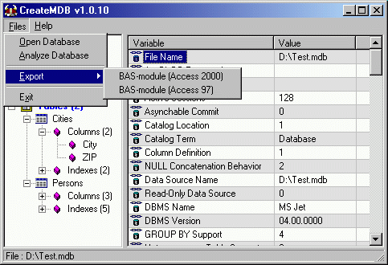



## CreateMDB v1\.0\.13 \(Update 5\)

### Description

CreateMDB will analyze and dump the sturture of an Access database into a BAS-module, you can include in your own project.

From your own project you can now create an access database on the fly.

This project is using ADO/ADOX v2.5 but will also work on v2.1.

Updates in v1.0.13 : Minor bug regarding Nullable columns fixed.

Updates in v1.0.12 : Minor bug regarding table description fixed, and found a solution regarding Nullable/Allow Zero lengh.

Updates in v1.0.11 : More tableproperties added and a MRU list added to menu.

Updates in v1.0.10 : Password dialog added, and some minor code updates.

Updates in v1.0.9 : Support for Queries aka Views and Procedures and improved Errorhandling.
 
### More Info
 

             |
---                |---
**Submitted On**   |2002-07-04 10:38:54
**By**             |[Niels Krogh](https://github.com/Planet-Source-Code/PSCIndex/blob/master/ByAuthor/niels-krogh.md)
**Level**          |Intermediate
**User Rating**    |4.8 (382 globes from 79 users)
**Compatibility**  |VB 5\.0, VB 6\.0
**Category**       |[Databases/ Data Access/ DAO/ ADO](https://github.com/Planet-Source-Code/PSCIndex/blob/master/ByCategory/databases-data-access-dao-ado__1-6.md)
**World**          |[Visual Basic](https://github.com/Planet-Source-Code/PSCIndex/blob/master/ByWorld/visual-basic.md)
**Archive File**   |[CreateMDB\_10170774200\.zip](https://github.com/Planet-Source-Code/niels-krogh-createmdb-v1-0-13-update-5__1-22085/archive/master.zip)

